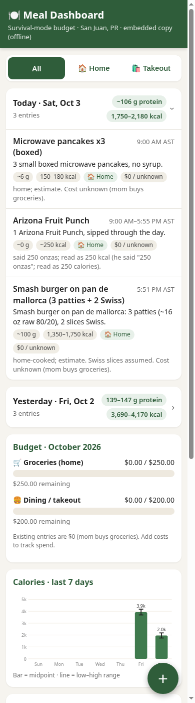

# 🍽️ Meal Dashboard

Phone-first, single-file meal & budget tracker (San Juan, PR). No build step, no CDN — works offline.



## View it
- **Offline / quick:** open `index.html` directly in a browser (`file://`). It uses the copy of the data embedded in the page.
- **Served (recommended):** from this folder run `python3 -m http.server 8000` and open <http://localhost:8000> (or on your phone at `http://<computer-ip>:8000` on the same Wi-Fi). Served over http(s), the page loads `data/meals.json` directly.

## Data
`data/meals.json` is the source of truth. Each entry:

| field | notes |
|---|---|
| `id` | unique string |
| `date` | `YYYY-MM-DD` |
| `time` | `HH:MM`, `HH:MM-HH:MM`, or `""` (through the day) |
| `time_label` | optional display text, e.g. `9:00 AM AST` |
| `name`, `details`, `portion`, `notes` | text |
| `protein_min`/`protein_max`, `kcal_min`/`kcal_max` | estimates; same number for both if not a range |
| `sugar_g` | optional |
| `source` | `home` or `takeout` |
| `cost_usd` | number (0 = unknown / mom bought it) |

Monthly budgets live in `budgets` ($250 groceries, $200 dining/takeout).

## Add meals
**Option A — edit the file:** add an entry to `data/meals.json`, then refresh the embedded offline copy and commit:
```sh
python3 scripts/embed.py
git commit -am "Log meals for 2026-10-04"
```

**Option B — in the page:** tap **+** to add, tap an entry to edit/delete. Changes are saved in that browser's `localStorage` only. To keep them, tap **Export JSON**, replace `data/meals.json` with the downloaded `meals.json`, run `python3 scripts/embed.py`, and commit. (**Export CSV** is an optional backup; CSV isn't tracked.)

**Reset to repo data** discards local edits in that browser.
